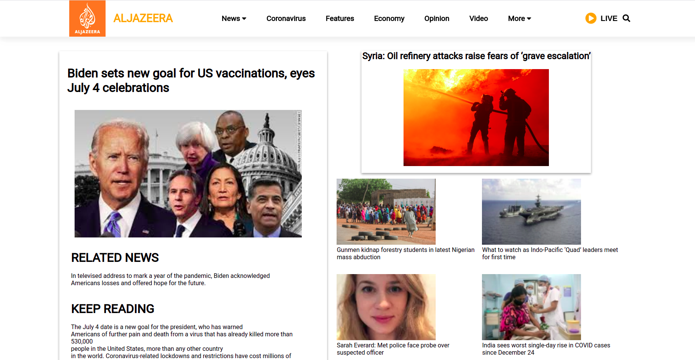
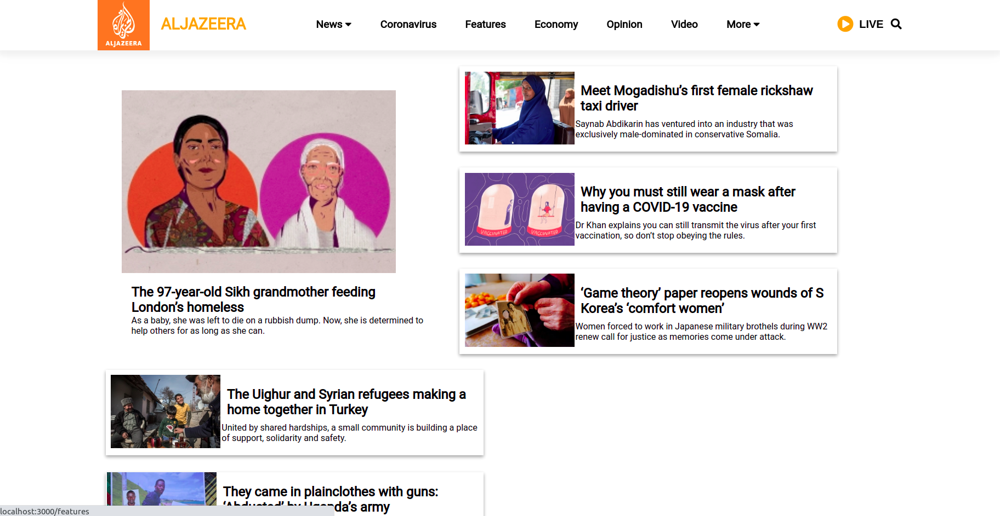
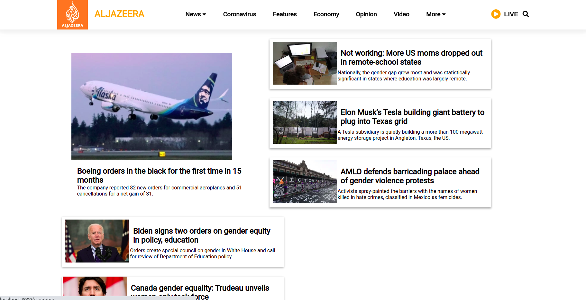
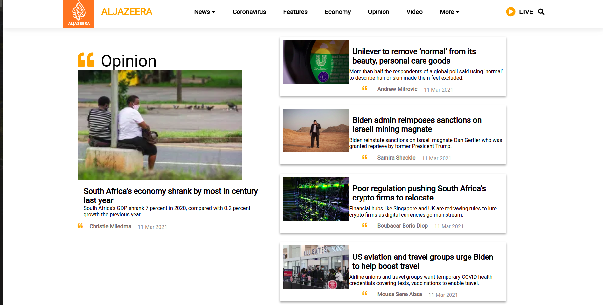
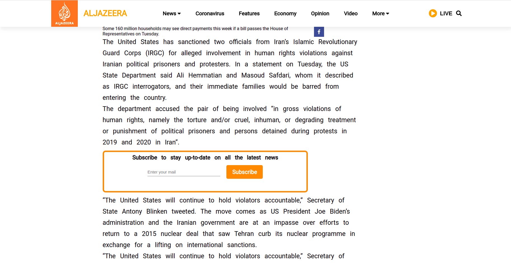

# Hexane - AljaZeera-Clone

# Technologies used

<li>React
<li> React-Redux
<li> HTML
<li> CSS
<li> Javascript

# Libraries used

<li> axios
<li> react
<li> react-adsense
<li> react-dom
<li> react-helmet
<li> react-icons
<li> react-loader-spinner
<li> react-player
<li> react-redux
<li> react-router-dom
<li> react-scripts
<li> react-share
<li> react-youtube
<li> redux
<li> redux-thunk
<li> styled-components

## Landing Page

## Corona Virus Page

## Features Page

## Economy Page

## Opinion Page

## Content Page

 <h1></h1>
👤 Rohan Ranjan

 <ul>
 <li>Github : rohanranjan25061996 
 </ul>

 <h1></h1>

<h1></h1>
👤 Sahil Sachdev

 <ul>
 <li>Github : isahilsachdev
 </ul>
<h1></h1>

<h1></h1>
👤 Prabhu Siddharth

 <ul>
 <li>Github :Siddharth308
 </ul>
 <h1></h1>

<h1></h1>
👤 Sidhant

 <ul>
 <li>Github : sidhant2709
 </ul>
